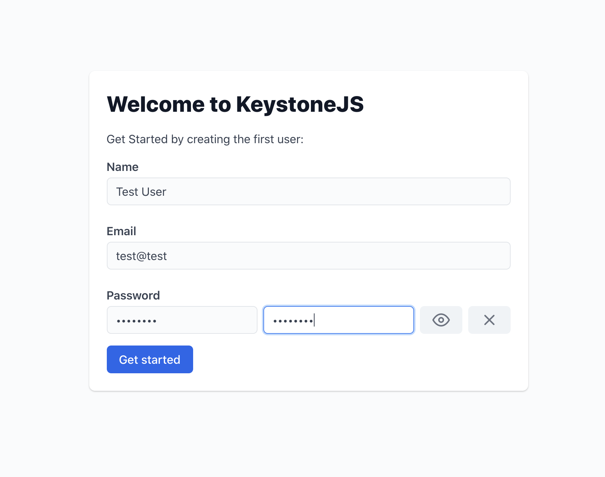
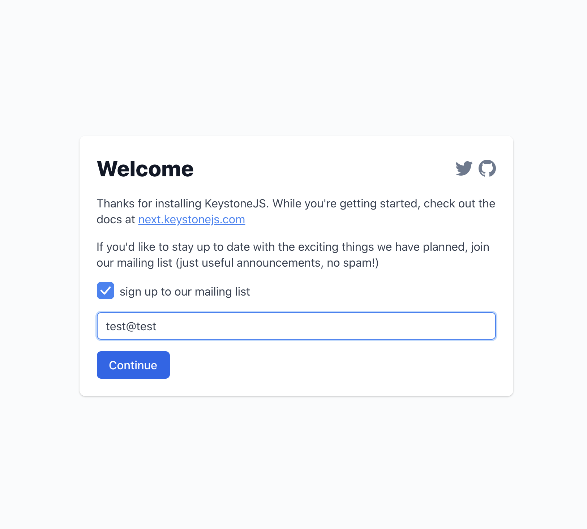
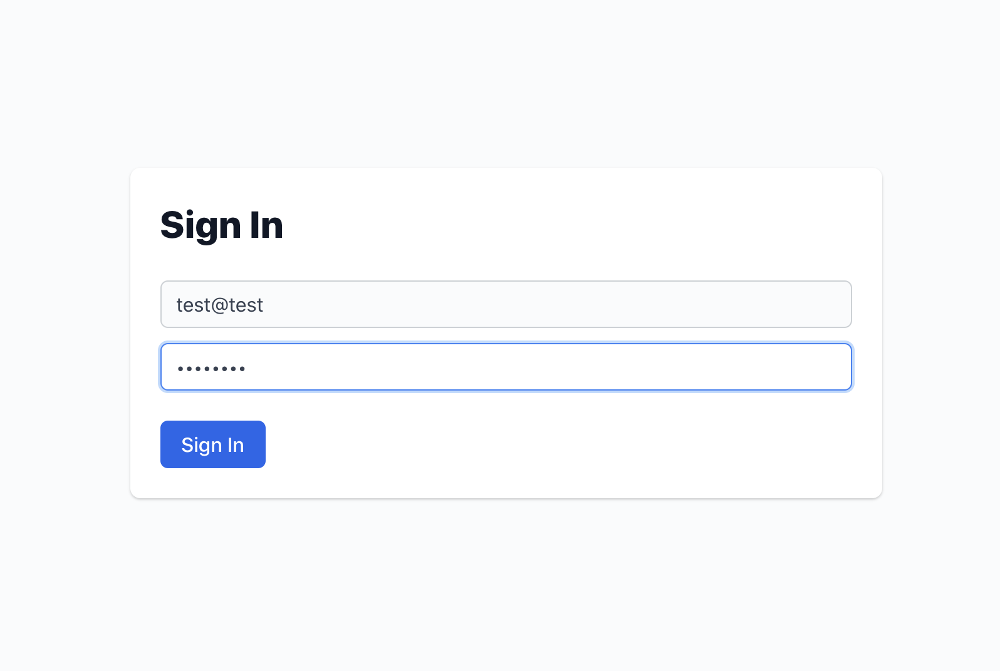

## Feature Example - Authentication

This project demonstrates how to add password based authentication to your Keystone system.
It builds on the [todo](../) starter project.

## Instructions

To run this project, clone the Keystone repository locally then navigate to this directory and run:

```shell
yarn dev
```

This will start the Admin UI at [localhost:3000](http://localhost:3000).
You can use the Admin UI to create items in your database.

You can also access a GraphQL Playground at [localhost:3000/api/graphql](http://localhost:3000/api/graphql), which allows you to directly run GraphQL queries and mutations.

## Features

This project shows you how to add authentication to your Keystone system. We're going to use the [`@keystone-next/auth`](https://next.keystonejs.com/apis/auth) package, along with Keystone's [session management API](https://next.keystonejs.com/apis/session), to add the following features to your system:

 * Configures which fields to use for signin
 * Sets up stateless session handling to keep track of the signed in user
 * Adds a signin screen to the Admin UI
 * Adds a signout button to the Admin UI
 * Allows the signed in user to access their own details in the Admin UI
 * Adds a helper page to the Admin UI to allow you to create your first user when starting from an empty database

### Added fields

We start by adding two new fields, `email` and `password`, to the `Person` list.
These will be used as our _identity_ and _secret_ fields for login.

```typescript
    email: text({ isRequired: true, isUnique: true }),
    password: password({ isRequired: true }),
```

### Auth config

```typescript
const { withAuth } = createAuth({
  listKey: 'Person',
  identityField: 'email',
  secretField: 'password',
  initFirstItem: { fields: ['name', 'email', 'password'] },
});
```

### Session

```typescript
const session = statelessSessions({ secret: '-- EXAMPLE COOKIE SECRET; CHANGE ME --' });
```

### Wrapped config

```typescript
export default withAuth(
  config({
    db: {
      provider: 'sqlite',
      url: process.env.DATABASE_URL || 'file:./keystone-example.db',
    },
    lists,
    session,
  })
);
```

## Screenshots

### Admin UI

Screenshots of the first item experience, mailing list experience(?), login screen, the "logged in as" bit, logout button.




### GraphQL Playground

Show off the new API that this has added and how to use it

### Somehow show session cookie data.

## Next steps

This project is a bare bones system, and doesn't use any of Keystone's advanced features.
We encourage you to experiment with the code here to see how Keystone works, become familiar with the Admin UI, and learn about the GraphQL Playground.

Once you've got the hang of using this project, you can check out the [feature examples](../).
These projects build on this starter project and show you how to use Keystones advanced features to take your project to the next level.
